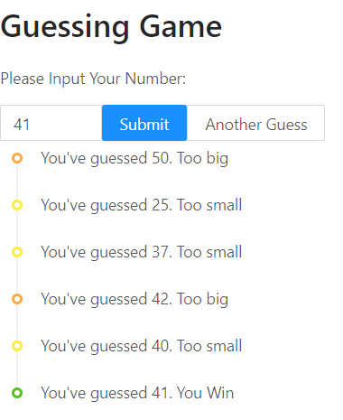

# Chapter 1 Guessing Game

本章将使用 React、ant.design 做一个小的猜数游戏。

前置技术：

- 对 JavaScript（TypeScript）有初步的了解
- 知道 HTML 的标签一般成对出现

需要使用：

- 已安装好 Node.js、Yarn [如何安装？](../appendix/A_nodejs.md)
- 编辑器 (推荐使用 Visual Studio Code)
  - ESLint 插件
  - Prettier 插件
- 浏览器 (推荐使用 Chrome)
- 良好的网络

最终效果

